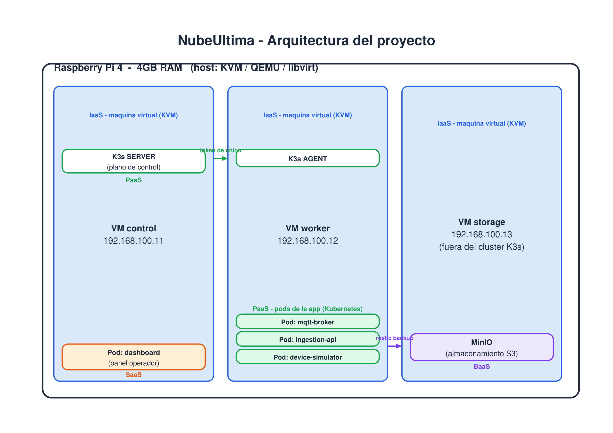
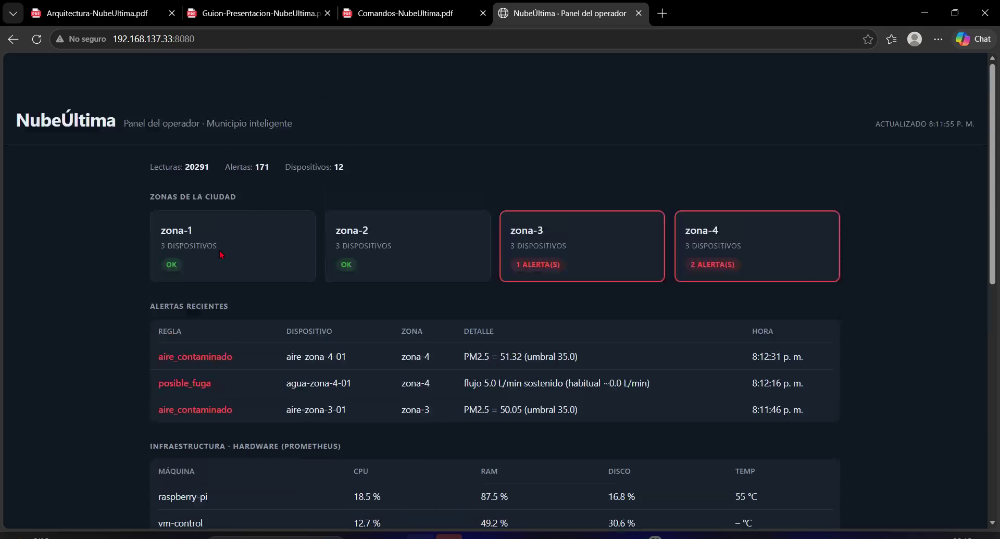

# NubeÚltima

Plataforma cloud de telemetría IoT para un municipio inteligente, construida de punta a
punta sobre una **Raspberry Pi 4 (4GB RAM)**, sin depender de ningún proveedor de pago.
Cubre las cuatro capas de servicio que pide el curso — **IaaS, PaaS, SaaS y BaaS** — todas
implementadas y verificadas funcionando, no solo diagramadas.

**Curso:** Sistemas Cloud y Tecnologías de Última Milla — Universidad del Istmo
**Catedrático:** Sergio Saenz

---

## El problema que resuelve

Un municipio normalmente se entera de un problema —una fuga de agua, un pico de consumo
eléctrico, aire contaminado— cuando ya es tarde: un vecino se queja, o el daño ya avanzó
horas sin que nadie lo note. La información existe, pero llega tarde porque depende de que
una persona note algo y decida reportarlo.

NubeÚltima simula una ciudad con medidores de luz, agua y sensores de calidad de aire
repartidos en 4 zonas, que mandan datos cada 15 segundos. Un sistema propio los analiza en
tiempo real comparando cada lectura contra lo que es normal para ese punto específico de la
ciudad, y en el momento en que algo se sale de lo esperado, el operador municipal lo ve en
un panel — sin depender de que nadie llame a avisar.

## Arquitectura



Todo corre dentro de una sola Raspberry Pi. Sobre ella corre **KVM**, con el que se crean 3
máquinas virtuales (capa **IaaS**). Sobre dos de esas VMs se instaló **K3s** (una
distribución liviana de Kubernetes, capa **PaaS**), donde corren los 4 microservicios de la
aplicación como contenedores. El panel web que usa el operador es la capa **SaaS**, y los
respaldos automáticos hacia MinIO son la capa **BaaS**.

| Capa | Implementación |
|------|----------------|
| **IaaS** | 3 máquinas virtuales (KVM/QEMU/libvirt) con IPs estáticas, creadas y destruidas por código (`infra/kvm/`) |
| **PaaS** | Clúster K3s de 2 nodos (server + agent), con los manifiestos de Kubernetes en `plataforma/k8s/` |
| **SaaS** | Panel web del operador municipal (`saas/dashboard/`), expuesto por NodePort |
| **BaaS** | MinIO (almacenamiento compatible S3) + restic (respaldos cifrados, deduplicados e incrementales), con verificación automática de restauración |

Cada decisión de tecnología fue el mismo ejercicio: balancear lo que se usa en producción
real contra lo que entra en 4GB de RAM sin caerse — por eso, por ejemplo, se usó SQLite en
vez de una base de datos con proceso propio, y Prometheus solo (sin Grafana) para el
monitoreo de hardware.

## Cómo funciona, de punta a punta

```
device-simulator → MQTT (Mosquitto) → ingestion-api → SQLite → dashboard
```

1. **`device-simulator`** genera una lectura realista por cada uno de los 12 medidores
   simulados (curva de consumo según la hora del día + ruido) y la publica por MQTT.
2. **`mqtt-broker`** (Mosquitto) reenvía el mensaje a quien esté suscrito.
3. **`ingestion-api`** lo recibe, lo valida, lo guarda en SQLite y lo compara contra las
   reglas de anomalía:
   - **Agua:** 3 lecturas seguidas por encima de 4 L/min, y además el doble de lo habitual
     para ese medidor en particular (evita falsas alarmas por un uso normal puntual).
   - **Luz:** una lectura por encima de 3.0 kWh instantáneos.
   - **Aire:** una lectura de PM2.5 por encima de 35.0 — el umbral que usa la Organización
     Mundial de la Salud para mala calidad del aire.
4. **`dashboard`** consulta al `ingestion-api` y a Prometheus, y se lo muestra al operador
   en tiempo real.

## Panel del operador (SaaS)



El panel muestra las zonas de la ciudad con su estado, las alertas recientes con el detalle
de por qué se dispararon, el monitoreo de hardware de las 4 máquinas (vía Prometheus), y el
estado del último respaldo verificado.

## Seguridad — Zero Trust

Toda comunicación dentro del clúster está bloqueada por defecto (`default-deny-ingress`), y
solo se abren los caminos estrictamente necesarios — por ejemplo, el microservicio principal
únicamente acepta conexiones del panel. Esta política se probó desplegando un pod "atacante"
de prueba dentro del propio clúster: la primera versión de la regla dejaba una puerta
abierta sin querer, se detectó con esa prueba, y se corrigió confirmando después que el
mismo pod de prueba quedaba bloqueado.

## Resiliencia — self-healing y respaldo verificado

- **Self-healing:** se borró un pod a mano en pleno funcionamiento para comprobar que
  Kubernetes lo reemplaza solo — tiempo de recuperación medido: **~12 segundos**, sin
  pérdida de datos (el volumen persistente es independiente del ciclo de vida del pod).
- **Backup verificado:** cada 30 minutos se respalda la base de datos y la configuración del
  clúster hacia MinIO, cifrado con restic. Cada 6 horas, un proceso independiente restaura
  el último respaldo y verifica su integridad — un respaldo que nadie probó restaurar no es
  un respaldo confiable.

## Estructura del repositorio

```
infra/                        infraestructura (IaaS)
├── pi-host/                  scripts que configuran la Raspberry Pi
├── kvm/                      definición y creación de las 3 VMs
├── ansible/                  configuración de las VMs (K3s, MinIO, tuning)
├── k3s/                      build de imágenes y despliegue del clúster
└── baas/                     scripts de respaldo y verificación

plataforma/                   la aplicación (PaaS)
├── device-simulator/         genera la telemetría simulada
├── ingestion-api/             microservicio de ingesta, reglas y API REST
└── k8s/                      manifiestos de Kubernetes de la aplicación

saas/dashboard/                panel web del operador (SaaS)

docs/
├── informe/                  informe y material de presentación
└── imagenes/                 capturas y diagramas de este README

pruebas/                       scripts de conectividad y simulacro de desastre
```

## Documentación adicional

- [`docs/informe/informe.md`](docs/informe/informe.md) — informe completo del proyecto
- [`docs/superpowers/specs/`](docs/superpowers/specs/) — documento de diseño original
- [`docs/superpowers/plans/`](docs/superpowers/plans/) — plan de implementación, tarea por tarea

## Integrantes y aportes

| Integrante | Área principal |
|---|---|
| **Daniel Cuá** | Infraestructura (VMs, KVM, red), operación del clúster y coordinación general |
| **Guillermo Rosemberg** | Lógica de negocio: reglas de anomalía, pipeline de ingesta MQTT, simulador de dispositivos |
| **Alejandra Velásquez** | Seguridad (NetworkPolicies, Zero Trust) y manifiestos de Kubernetes |
| **Sofía Martínez** | Detección de anomalías en vivo, autorreparación (self-healing) y sistema de respaldo (BaaS) |

## Estado

**Proyecto terminado (Fase 1).** Las 4 capas de servicio están implementadas, desplegadas y
verificadas funcionando en la Raspberry Pi — incluyendo pruebas activas de seguridad,
autorreparación y restauración de respaldos, no solo su descripción teórica.
